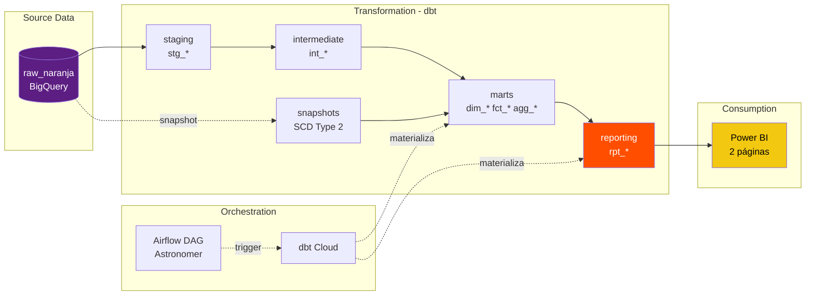

# Analytics Credit — dbt Project

> Use case de analytics de portfolio de crédito para fintech. Simulación de dominio de producto crediticio similar a Naranja X, con arquitectura Kimball completa (staging → intermediate → marts → reporting), tests exhaustivos, CI/CD en GitLab, orquestación con Airflow, y dashboard ejecutivo en Power BI.

[](https://www.getdbt.com/)
[](https://cloud.google.com/bigquery)
[](https://airflow.apache.org/)
[](https://powerbi.microsoft.com/)

---

## Arquitectura



La lógica de negocio vive en el warehouse expresada en SQL testeable y version-controlado. Power BI actúa como **visualizador puro**: ratios (approval rate, delinquency rate, ticket promedio, DPD ponderado) se calculan en DAX con `DIVIDE(SUM, SUM)` sobre columnas pre-agregadas en `rpt_*`, preservando correctness bajo cualquier filter context.

Los reporting marts (`rpt_executive_summary`, `rpt_portfolio_delinquency`) exponen data con el grano exacto que el dashboard consume. Cuando cambia una definición de negocio, el cambio vive en dbt y se propaga solo — no en 15 medidas DAX opacas.

---

## Highlights técnicos

- **111 data tests** cubriendo unique constraints, referential integrity, accepted values y range assertions sobre 17 modelos
- **SCD Type 2** implementado con `dbt snapshots` sobre `credit_bureau` para trazabilidad de scores históricos
- **Surrogate keys via macro custom** (`generate_customer_sk`) para consistencia entre facts y dims
- **Incremental fact** (`fct_payments`) con `merge` strategy, partition mensual y clustering sobre `bucket_code + customer_sk + due_date`
- **Reporting layer explícita** (`rpt_*`) con grano dimensional (`period_month + product + segment`) — Power BI hace solo `SUM/COUNT/DIVIDE`
- **CI/CD en GitLab** con service account BigQuery least-privilege, valida `dbt parse + compile` en cada MR
- **Airflow DAG productivo** con freshness check + trigger dbt Cloud + on_failure_callback + exponential backoff
- **Kimball semántico**: dimensiones conformadas (`dim_date` en schema `core` accesible desde múltiples dominios)

---

## Stack

| Capa | Herramienta |
|---|---|
| Warehouse | Google BigQuery |
| Transformación | dbt-bigquery 1.12 |
| Orquestación | Apache Airflow (Astronomer) + dbt Cloud API |
| Version Control | GitLab (canonical) + GitHub (archive) |
| CI/CD | GitLab CI con service account BigQuery |
| Visualización | Power BI Desktop |
| Auth local | gcloud OAuth ADC (Application Default Credentials) |
| Auth CI | Service Account JSON key con least privilege |

---

## Dashboards

### Página 1 — Resumen de créditos

KPIs ejecutivos del funnel de originaciones: solicitudes, aprobaciones, volumen otorgado, ticket promedio. Split por producto (Tarjeta / Personal / Línea) y segmento comercial (A/B/C/D).

_[Screenshot: `docs/screenshots/dashboard-resumen.png`]_

### Página 2 — Cartera

Distribución de portfolio por bucket de mora (CURRENT / B1-29 / B30-59). Monto en mora por producto, matriz cross-filter producto × bucket, KPIs de DPD promedio y clientes únicos con exposición.

_[Screenshot: `docs/screenshots/dashboard-cartera.png`]_

---

## Anécdotas técnicas defendibles

### 1. Bug de producción — `on_schema_change='append_new_columns'`

Un test de `not_null_customer_sk` falló en prod con 43/44 rows NULL. Debug en 4 queries: source limpia, no había orphans, `dim_customers` OK. Root cause: cuando agregué `customer_sk` al modelo incremental `fct_payments`, dbt hizo `ALTER TABLE ADD COLUMN` silencioso vía el default `on_schema_change='append_new_columns'`, dejando NULL en rows históricas.

**Fix inmediato:** `dbt run --full-refresh --select fct_payments --target prod`  
**Fix estructural:** cambio a `on_schema_change='fail'` — prefiero que el pipeline explote antes que aplicar cambios silenciosos que rompen tests downstream.

Descubrimiento adicional: el full-refresh trajo 27 rows adicionales que el incremental con lookback de 3 días estaba perdiendo (late-arriving payments). La tasa de mora real subió de 11.54% a 14.08% — el dashboard viejo estaba subestimando riesgo por bug del pipeline. La migración destapó el problema.

### 2. Power BI como visualizador puro

Migración de dashboard legacy donde las medidas DAX usaban `CALCULATE + COUNTROWS + filters sobre facts atómicos` a un modelo donde Power BI hace solo `SUM(columna)` sobre `rpt_executive_summary`. Cada ratio es `DIVIDE(SUM(numerador), SUM(denominador), 0)` — permite recalcular correcto bajo cualquier filter context (mes, quarter, YTD, por producto).

Especial cuidado con AVG: guardado como `SUM(days_past_due)` + `SUM(payments_count)` separados. Promedio de promedios es matemáticamente incorrecto cuando los grupos tienen distinto tamaño — patrón anti-pattern silencioso en dashboards mid.

### 3. Migración de sintaxis dbt 1.10+ (deprecation warnings)

Al deployar el primer reporting mart a prod, dbt tiró 11 warnings de `MissingArgumentsPropertyInGenericTestDeprecation`. En dbt 1.15+ va a ser error. Abrí un MR `chore/` dedicado migrando todos los generic tests a la sintaxis nueva con la key `arguments:`. Warnings son errors del futuro — un Sr no ignora deprecations aunque aún funcionen.

---
## Estructura del repo

analytics-credit-dbt/
├── models/
│ ├── staging/ # stg_* — 1:1 con sources, renaming + typing
│ ├── intermediate/ # int_* — lógica de negocio compleja
│ ├── marts/
│ │ ├── dims/ # dim_customers, dim_date, dim_products
│ │ ├── facts/ # fct_applications, fct_originations, fct_payments
│ │ └── reporting/ # rpt_* — power bi consumers
│ └── ...
├── macros/ # generate_customer_sk, mask_pii
├── snapshots/ # SCD Type 2 sobre credit_bureau
├── seeds/ # holidays_ar, catalog_products
├── tests/ # generic + singular tests
├── .gitlab-ci.yml # dbt parse + compile en cada MR
├── profiles.yml # CI profile (service account)
├── packages.yml # dbt_utils, codegen
└── dbt_project.yml---

## Setup local

```bash
# 1. Clonar el repo
git clone git@gitlab.com:CarlosLeguiz/analytics-credit-dbt.git
cd analytics-credit-dbt

# 2. Python venv + dbt
python -m venv venv
source venv/bin/activate  # Windows: venv\Scripts\Activate.ps1
pip install dbt-bigquery==1.12.0

# 3. Auth con gcloud
gcloud auth application-default login

# 4. profiles.yml local con OAuth (ver docs/setup.md)
# Setear DBT_PROFILES_DIR apuntando a ~/.dbt/

# 5. Install packages + verify + run
dbt deps
dbt debug --target dev
dbt build --target dev
```

---

## Governance

Todo cambio pasa por: branch → MR → CI verde → squash merge. Convenciones de branch naming:

- `feat/` — nueva funcionalidad
- `fix/` — bug fix
- `refactor/` — cambio sin efecto funcional
- `chore/` — mantenimiento / deuda técnica
- `docs/` — documentación

CI corre `dbt parse` + `dbt compile` en cada MR contra un service account BigQuery con least privilege (`BigQuery Job User` + `BigQuery Data Viewer`). El compile atrapa 95% de errores comunes en <40 segundos sin materializar data.

Prod se materializa solo desde `main` mergeado, ejecutado por dbt Cloud job triggereado desde Airflow a las 6am diarias. Ningún dev con OAuth toca prod desde local — principio de least privilege aplicado a humanos.

---

## Limitaciones conocidas

Proyecto de portfolio single-dev con datos sintéticos. Limitaciones honestas:

- **Datos estáticos** (~100 customers, 142 applications, 72 originations, 71 payments). Optimizaciones de partition/cluster imperceptibles a este volumen.
- **SCD Type 2 estructural pero sin history real** — cada cliente tiene una sola versión del bureau_score. En producción con drift real, se materializarían múltiples versiones.
- **Sin CODEOWNERS por dominio** — single-dev.
- **Sin monitoring productivo** tipo Elementary Data. Documentado como próximo paso.
- **Datos de payments concentrados en 3 meses** (may/jun/jul 2026) — evolución temporal es simbólica, no analítica.

---

## Autor

**Carlos Leguizamón** — Data & BI Analyst  
Córdoba, Argentina  
[LinkedIn](https://linkedin.com/in/carlos-leguizamon) · [GitLab](https://gitlab.com/CarlosLeguiz)